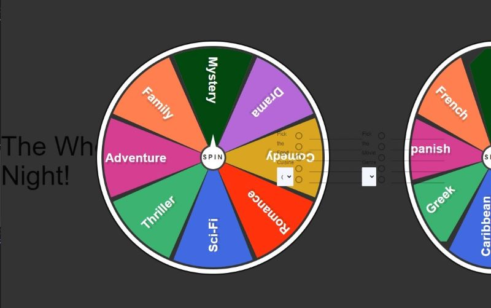
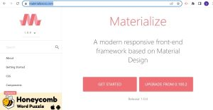

# Wheels of Date Night

## Description

write description here

## Table of Contents
- [Website Preview](#website-preview)
- [Concept](#concept)
    - [User Story](#user-story)
    - [Motivation and Development](#motivation-and-development)
        - [Motivation / One-minute-pitch](#motivation--one-minute-pitch)
- [Process](#process)
    - [Technologies Used](#technologies-used)
    - [Tasks](#tasks)
    - [Challenges Encountered](#challenges-encountered)
    - [Successes in Development](#successes-in-development)
- [Future Development](#future-development)
- [Credits](#credits)
- [Resources](#resources)
    - [Materialize CSS Framework](#materialize-css-framework)
- [Special Thanks](#special-thanks)
- [License](#license)

## Website Preview

[Wheels of Date Night](https://esbev.github.io/project-1-collab/)

## Concept

- ### User Story

    AS A romantic couple

    I WANT to get unique ideas for dinner and a movie

    SO THAT I can plan a quick and spontaneous date night

    GIVEN a pair of spinner wheels and a spin button

    WHEN I click on the spin button

    THEN I am presented with two spinning wheels

    WHEN I view the wheels stop

    THEN I am presented with a random cuisine type and a random film genre

    WHEN I am presented with a random cuisine type and a random film genre

    THEN I am automatically presented with 5 random dishes from the cuisine type and 5 random movies from the film genre

    WHEN I click on a dish and a movie

    THEN I am presented with a save button

    WHEN I click the save button

    THEN I am presented with a list of saved date nights with my food and movie selections, and the dish and movie lists clear

    WHEN I comeback to the page

    THEN I can view all previously saved date nights

- ### Motivation and Development

    - #### Motivation / One-minute-pitch

        Everyone has their comfort food, their regular dishes they cook, their regular restaurants, their favorite items on a menu they choose every single time, their regular TV shows, their regular channels they watch, those same old movies they watch again and again and again. Unfortunately date nights are not immune to these iterative default parameters as well.

        But nevertheless you suddenly find yourself with a evening alone with your signifcant other but you don't have time to plan a big date. So it looks like your going to have to settle for another thoughtless, monotonous, boring, tasteless "Dinner and a Movie."

        We take the thoughtless and think for you.

        We take the monotonous and add color.

        We take the boring and bring excitement.

        We take the tasteless and spice it up.

        If you want to plan an elaborate date night, then we suggest you plan ahead. But if you don't have time for that, then let us take you and your significant other to the "Wheels of Date Night."

## Process

- ### Technologies Used

- ### Tasks

- ### Challenges Encountered

- ### Successes in Development

## Future Development

In future development we can expand the choices of cuisines and genres presented. We can blend cuisines and blend genres for even more focused choices of food and movies.

We could use geolocation to add the user's area then present local restaurants based on the dish selected, and local theaters playing the movie selected.

Bring in more APIs to add more parameters to the spontaneous date night experience. Such as local businesses with games, action oriented activities like wall climbing, go-kart racing, etc. We could include parameters for events happening locally like festivals, wine tasting, music events etc.

## Credits

## Resources

NOTE: Click on a thumbnail to view source

- ### Materialize CSS Framework

 - 

## Special Thanks

Thanks goes out to all the instructors and teacher assistants for their clear instruction and prompt and thorough answers to all our questions.

Also, thanks to.

## License

MIT License

Copyright (c) 2023 Eric

Permission is hereby granted, free of charge, to any person obtaining a copy
of this software and associated documentation files (the "Software"), to deal
in the Software without restriction, including without limitation the rights
to use, copy, modify, merge, publish, distribute, sublicense, and/or sell
copies of the Software, and to permit persons to whom the Software is
furnished to do so, subject to the following conditions:

The above copyright notice and this permission notice shall be included in all
copies or substantial portions of the Software.

THE SOFTWARE IS PROVIDED "AS IS", WITHOUT WARRANTY OF ANY KIND, EXPRESS OR
IMPLIED, INCLUDING BUT NOT LIMITED TO THE WARRANTIES OF MERCHANTABILITY,
FITNESS FOR A PARTICULAR PURPOSE AND NONINFRINGEMENT. IN NO EVENT SHALL THE
AUTHORS OR COPYRIGHT HOLDERS BE LIABLE FOR ANY CLAIM, DAMAGES OR OTHER
LIABILITY, WHETHER IN AN ACTION OF CONTRACT, TORT OR OTHERWISE, ARISING FROM,
OUT OF OR IN CONNECTION WITH THE SOFTWARE OR THE USE OR OTHER DEALINGS IN THE
SOFTWARE.