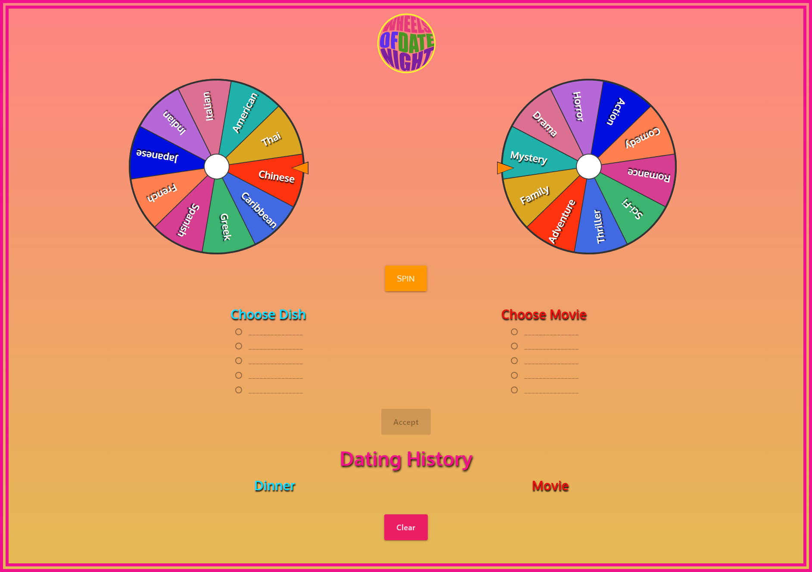

# Wheels of Date Night 

  

## Description

Wheels of Date Night provide a user-friendly experience to quickly get unique options for food and movies as viable date night ideas. The application is easy and fun to use. Simply click the spin button and the fun begins. 

Two wheels are presented and once the spin button is clicked, both will randomly rotate to pick a food cuisine and movie genre. When the wheels come to a stop, a pointer will indicate to the user which choice each wheel has chosen.

Below the wheels, the user is presented with 5 food options from the cuisine type and 5 movies from the genre list. The user only needs to choose a dish and a movie from the options and click the accept button. Doing so will save the user's input then list the 2 choices combined as a previous date. 

The option to clear previous food and movie lists is available by use of the clear button below. All previously saved dates will auto populate in the “Dating History" when the user returns to the app. 

You just took a simple dinner and a movie and made it exciting. Good luck and enjoy your date.

## Table of Contents
- [Website Preview](#website-preview)
- [Concept](#concept)
    - [User Story](#user-story)
    - [Motivation and Development](#motivation-and-development)
        - [Motivation / One-minute-pitch](#motivation--one-minute-pitch)
- [Process](#process)
    - [Technologies Used](#technologies-used)
- [Future Development](#future-development)
- [Credits](#credits)
- [Resources](#resources)
    - [Materialize CSS Framework](#materialize-css-framework)
- [Special Thanks](#special-thanks)
- [License](#license)

## Website Preview

[Link to our Deployed Page](https://esbev.github.io/project-1-collab/)

.png)
.png)

## Concept

- ### User Story

        AS A romantic couple
        I WANT to get unique ideas for dinner and a movie
        SO THAT I can plan a quick and spontaneous date night

- ### Acceptance Criteria

        GIVEN a pair of spinner wheels and a spin button
        WHEN I click on the spin button
        THEN I both wheels begin to spin
        WHEN I view the wheels stop
        THEN I am presented with a random cuisine type and a random film genre.
        WHEN I am presented with a random cuisine type and a random film genre
        THEN I am automatically presented with 5 random dishes from the cuisine type and 5 random movies from the film genre.
        WHEN I click on a dish and a movie
        THEN I am presented with an enabled Accept button.
        WHEN I click the Accept button
        THEN I am presented with a list of saved date nights with my food and movie selections along with a clear button to clear previous entries.
        WHEN I refresh the page
        THEN I can view all previously saved date nights.

- ### Motivation/Development

    - #### One-minute-pitch

            Everyone has their favorite comfort food, their go-to cooking recipes, their regular restaurants, and even their favorite items on a menu that they choose every single time.

            They also have their regular TV shows, binging the same show over and over to the point where you know the script by heart. Movies wouldn’t just be a one time experience, but a WEEKLY routine. We are creatures of habit and unfortunately date nights are not immune to these familiar feelings of excitement becoming commonplace and bland.

            But nevertheless, you find yourself again on an evening alone with your significant other with no big plans for an exciting date. It looks like you’re just going to have to settle for another thoughtless, monotonous, boring, and tasteless "Dinner and a Movie”.

            We take the thoughtless and think for you.

            We take the monotonous and add color.

            We take the boring and bring excitement.

            We take the tasteless and spice it up.

            If you want to plan an elaborate date night, then we suggest you plan ahead. But if you don't have the time for that, then let us take the worry out of the situation.

            Our collaborative project has brought us to solve a problem that a lot of people experience. We propose a solution; through discovering a new dish and enjoying a potential hidden gem of a film, we have created:

            “Wheels of Date Night!”

- ## Technologies Used

    - ### Spoonacular API 
    - ### themoviedb API
    - ### Materialize CSS

- ## Future Development

    - ### By taking in latitude and longitude of the user’s current location, we could expand our food location options to include local restaurants and theaters based on the dish and movie selected.
 
    - ### Yelp API would be a beneficial addition to the application by not only providing the location but also reviews. Local businesses with games and leisurely activities like sports, museums, and music performances are awesome date night ideas. For future development, we could include parameters for events happening locally within your area like festivals, painting, and other group-oriented happenings.

- ## Credits

- ### Resources
    - #### Spoonacular API

        - (https://spoonacular.com/food-api)

    - #### themoviedb API

        - (https://developer.themoviedb.org/reference/intro/getting-started)

    - #### Spinning Wheels Reference

        - (https://www.youtube.com/watch?v=ETFdNsBP04c)

        - (https://www.youtube.com/watch?v=F3-lK_-PQr0)

    - #### Materialize CSS Framework

        

- ## Special Thanks

    - ### Thanks goes out to all the instructors and teacher assistants for their clear instruction and prompt and thorough answers to all our questions.

    - ### Also, thanks to the development team. Each member brought fantastic ideas and great skills to make this dream a reality.

## License

MIT License

Copyright (c) 2023 Eric

Permission is hereby granted, free of charge, to any person obtaining a copy
of this software and associated documentation files (the "Software"), to deal
in the Software without restriction, including without limitation the rights
to use, copy, modify, merge, publish, distribute, sublicense, and/or sell
copies of the Software, and to permit persons to whom the Software is
furnished to do so, subject to the following conditions:

The above copyright notice and this permission notice shall be included in all
copies or substantial portions of the Software.

THE SOFTWARE IS PROVIDED "AS IS", WITHOUT WARRANTY OF ANY KIND, EXPRESS OR
IMPLIED, INCLUDING BUT NOT LIMITED TO THE WARRANTIES OF MERCHANTABILITY,
FITNESS FOR A PARTICULAR PURPOSE AND NONINFRINGEMENT. IN NO EVENT SHALL THE
AUTHORS OR COPYRIGHT HOLDERS BE LIABLE FOR ANY CLAIM, DAMAGES OR OTHER
LIABILITY, WHETHER IN AN ACTION OF CONTRACT, TORT OR OTHERWISE, ARISING FROM,
OUT OF OR IN CONNECTION WITH THE SOFTWARE OR THE USE OR OTHER DEALINGS IN THE
SOFTWARE.